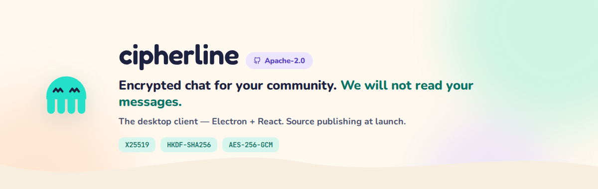

<div align="center">
  
</div>

<br/>

<div align="center">

**The privacy-first alternative to Discord, Slack, and Teams — end-to-end encrypted.**

[Website](https://cipherline.chat) · [Security](https://cipherline.chat/security) · [Report a vulnerability](SECURITY.md)

</div>

---

## What Cipherline is

Your own servers, roles, channels, voice and video calls, and screen share. Your
messages, files and calls are encrypted on your device before they leave it, so our
server relays them without being able to read them. It still has to see some things
to deliver them (who you're connected with, when, and how big a file is); the full,
honest list is at [cipherline.chat/security](https://cipherline.chat/security).

## What's in this repo

The full source of the Cipherline **desktop client** (Electron + React), Apache-2.0
licensed. It's the code of the current stable release: each stable release
replaces this tree, and the stable downloads are built from it by the release
workflow.

- `apps/desktop` — the desktop app (Electron main process in `electron/`, React UI in `src/`)
- `packages/shared` — the message and API types shared with the server
- `apps/desktop/LICENSES.md` — third-party dependency attributions

## Start here: the crypto

Standard, well-reviewed constructions, no hand-rolled crypto: X25519 key exchange,
HKDF-SHA256 derivation, AES-256-GCM for content and Ed25519 signatures. If you only
read a few files, read these:

| File | What it does |
|---|---|
| [`apps/desktop/electron/e2ee-engine.ts`](apps/desktop/electron/e2ee-engine.ts) | Message encryption: X25519 ECDH + HKDF-SHA256 + AES-256-GCM |
| [`apps/desktop/electron/signal-identity.ts`](apps/desktop/electron/signal-identity.ts) | Identity keys and prekeys |
| [`apps/desktop/src/utils/crypto.ts`](apps/desktop/src/utils/crypto.ts) | File and attachment encryption (WebCrypto AES-256-GCM) |
| [`apps/desktop/src/utils/secureLocalStore.ts`](apps/desktop/src/utils/secureLocalStore.ts) | Encrypted storage at rest on your device |
| [`apps/desktop/electron/storage.ts`](apps/desktop/electron/storage.ts) | Device master key, wrapped by the OS keystore (DPAPI / Keychain / libsecret) |

What each part protects today, and what our server can still see, is spelled out at
[cipherline.chat/security](https://cipherline.chat/security).

## Build it yourself

Node 20. The same steps the release workflow runs ([`release-stable.yml`](.github/workflows/release-stable.yml)):

```bash
npm ci --legacy-peer-deps
cd apps/desktop
npm run rebuild-native
npm run build
npm test
```

A build you make yourself is fine for inspecting and running the code. Official
releases are signed and published only by the release workflow.

## Why the client and not the server

Because "trust us, it's encrypted" isn't good enough — a claim like that should be
checkable. The client is what touches your messages, keys and calls, so it's what
we're publishing. The server stays closed: it's a blind relay that never holds the
keys to your content either way, and keeping its code private mainly slows abuse
rather than hiding anything it could read.

## More

- **[cipherline.chat/opensource](https://cipherline.chat/opensource)** — how we
  think about open source, and the licence in plain words.
- **[cipherline.chat/security](https://cipherline.chat/security)** — what each
  client encrypts today and what our server can still see.
- **[cipherline-mobile](https://github.com/Cipherline-chat/cipherline-mobile)** —
  the mobile client's repo (closed beta); its source isn't published there yet.

---

<div align="center">
<sub>Cipherline — encrypted chat for your people.</sub>
</div>
